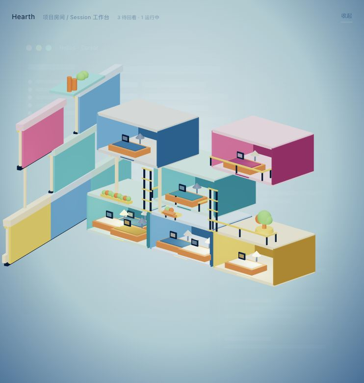

# Hearth

Hearth 是一个面向多项目、多 Session、多 Agent 工作流的 3D 记忆宫殿原型。

它把“回到一个会话”这件事从列表、卡片和日志里拿出来，变成一个可以被空间记住的动作：项目是房间，Session 是房间里的工作台，Agent / IDE 是工作台的属性。用户回到工作时，不只是看摘要，而是回到一个熟悉的位置。



## 核心想法

当一个人同时使用多个 IDE、多个 AI Agent、多个项目和多个会话时，真正困难的不是“有没有信息”，而是“我怎么快速恢复注意力”。

Hearth 的目标是让工作上下文拥有稳定的空间形态：

- 哪个项目需要回看，可以从亮灯的房间看出来。
- 哪个 Session 正在运行，可以从工作台和台灯状态看出来。
- 哪个 Agent 参与了这段工作，可以从颜色和房间装饰看出来。
- 哪些项目在同一个工作场里，可以通过空间位置和楼层关系感知出来。

## 概念模型

### Project = 房间

每个项目对应一间房间。房间不是信息卡片的 3D 化，而是一个可记忆的位置：它在建筑中的层级、颜色、窗户和墙面标记共同构成项目识别。

### Session = 工作台

一个项目可以有多个 Session，因此房间里可以有多张工作台。每张工作台代表一个正在运行、已回复或暂时空闲的会话。

### Agent = 属性

Agent 和 IDE 不是最外层叙事。它们更像工作台和房间的属性，通过颜色、灯光、装饰件和状态细节表达。

### Attention = 灯光

需要用户回看的项目会亮灯。Hearth 不试图把所有信息都展示出来，而是先回答一个更重要的问题：哪里需要我重新进入？

## 交互形态

Hearth 有两个主要状态：

- **收起态**：一个可以悬浮在桌面或 IDE 上方的小建筑图标，低打扰地提示项目状态。
- **展开态**：一个透明悬浮的 3D 剖面沙盘，展示项目房间、Session 工作台、梯子、栏杆、花坛和项目首字母标识。

它不是第一人称漫游，也不是完整 3D 游戏。它更接近一个可以快速扫视的等距建筑模型：打开快、识别快、切回上下文快。

## 当前 MVP

已实现：

- 3D 建筑剖面
- 收起态小建筑 icon
- 透明 Electron 桌面悬浮窗
- 项目房间与 Session 工作台
- 基于 Session 状态的房间亮灯
- 工作台台灯和屏幕状态
- 房间墙面项目首字母
- 标准化结构件：柱子、梯子、栏杆、花坛
- 明亮等距插画风配色
- Hover / 聚焦时的项目信息面板

暂不包含：

- 真实 Agent / IDE Webhook
- 自动上下文总结
- 持久化用户数据
- 大量项目的自动空间排布
- 完整资产建模流程
- 打包发布流程

## 本地运行

安装依赖：

```bash
npm install
```

浏览器预览：

```bash
npm run dev
```

默认地址：

```text
http://127.0.0.1:5173/
```

桌面悬浮窗预览：

```bash
npm run desktop:dev
```

如果 Vite dev server 已经在运行，也可以只启动 Electron：

```bash
npx electron electron/main.cjs
```

构建并用 Electron 打开：

```bash
npm run desktop
```

## 技术栈

- Vite
- React
- TypeScript
- Three.js
- React Three Fiber
- Drei
- Tailwind CSS
- Electron

## 项目结构

```text
electron/
├── main.cjs              # 透明悬浮窗口、窗口模式切换、拖拽 IPC
└── preload.cjs           # 暴露桌面窗口 API

src/
├── App.tsx
├── components/hearth3d/
│   ├── Hearth3D.tsx              # 3D 交互入口与视图状态
│   ├── BuildingModel.tsx         # 展开态建筑剖面
│   ├── CollapsedBuildingIcon.tsx # 收起态小建筑
│   ├── ProjectRoom3D.tsx         # 项目房间和墙面首字母
│   ├── SessionDesk3D.tsx         # Session 工作台
│   ├── DeskLamp.tsx              # 工作台灯
│   ├── WindowLight.tsx           # 外立面窗灯
│   ├── CameraRig.tsx             # 相机过渡
│   ├── layout.ts                 # 房间布局
│   └── spaceTokens.ts            # 空间尺寸与颜色 token
├── data/projects.ts              # 项目、Session、Agent 假数据
└── types/hearthDesktop.d.ts      # Electron preload 类型

public/assets/readme-hearth.jpg   # README 截图
```

## 设计原则

Hearth 不想做一个更重的任务管理器。它的重点是降低“回到上下文”的认知摩擦。

空间、颜色、灯光和重复出现的地标可以帮助用户建立记忆。当用户看见这个小建筑时，应该能很快想起来：我在哪里，我刚才在做什么，下一步该回到哪个房间。
